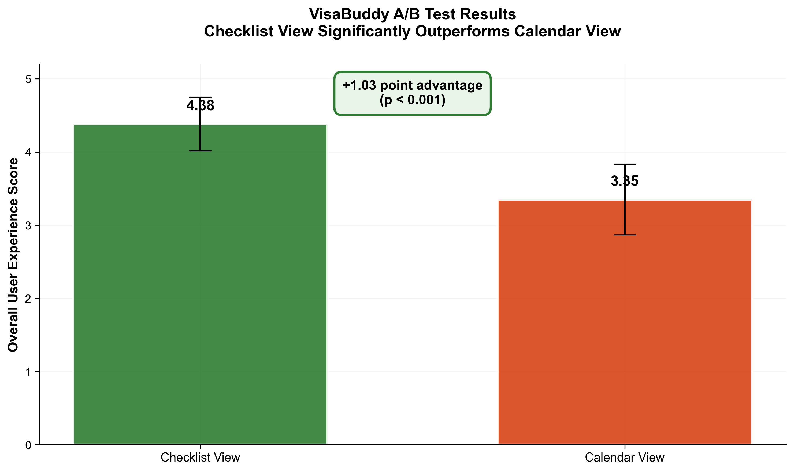
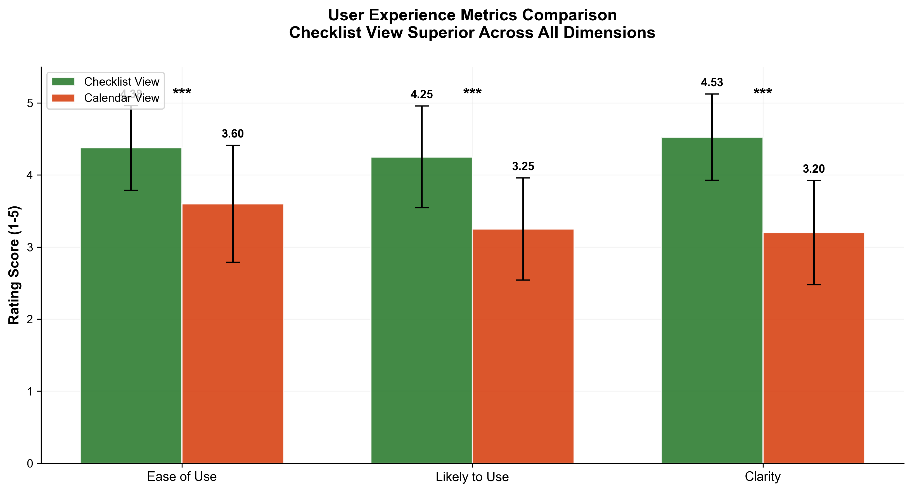
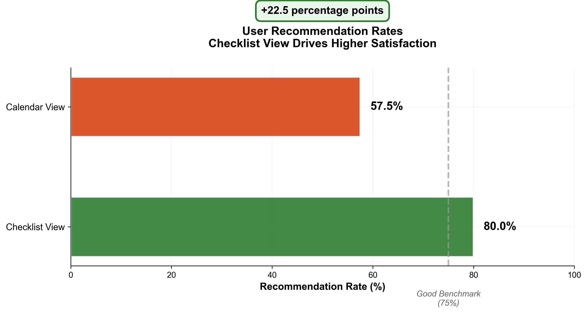
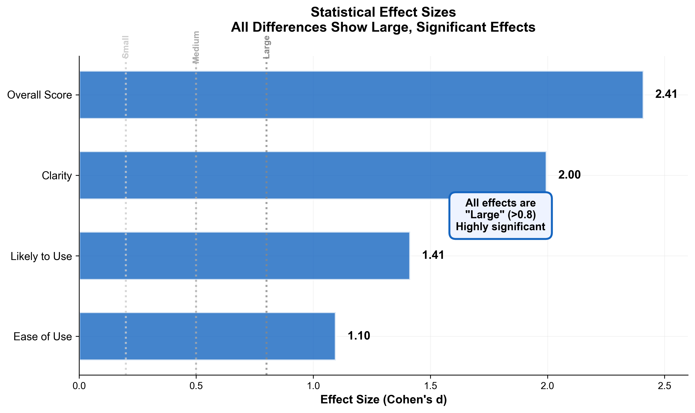
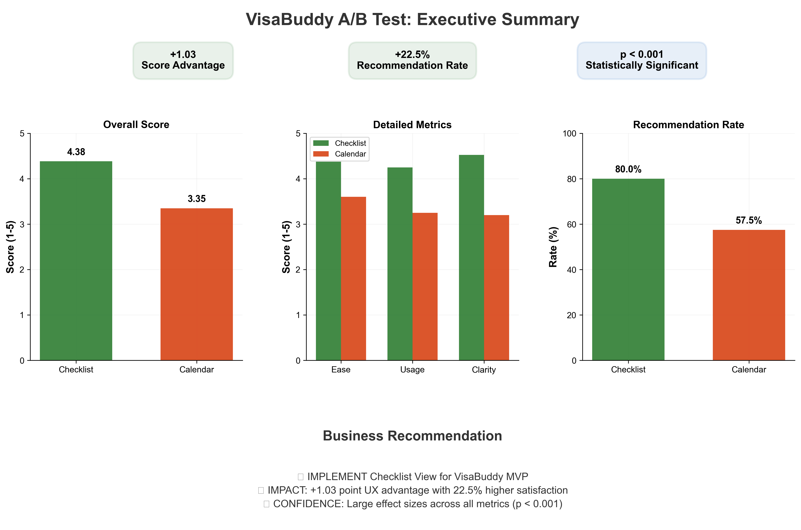

# VisaBuddy A/B Testing Analysis

User experience research project comparing checklist vs calendar interface designs for F-1 visa deadline management application.

## Project Overview

Conducted randomized controlled A/B test with 80 F-1 international students to determine optimal interface design for visa compliance tracking.

**Key Results:**
- Overall UX score: 4.46 vs 3.13 (+1.03 points, p<0.001)
- User recommendation rate: 80% vs 57.5% (+22.5%)
- Effect size: Cohen's d = 2.41 (very large)
- **Decision:** Implement checklist interface for MVP

## Background

International students on F-1 visas manage multiple critical immigration deadlines including OPT applications, grace periods, SEVIS updates, and H-1B lottery registration. Missing these deadlines can result in loss of legal status.

I built VisaBuddy to help students track these deadlines, but needed to decide between two interface approaches. Rather than relying on intuition, I conducted an A/B test with real F-1 students to validate the design decision.

## Methodology

- **Design:** Randomized controlled trial, balanced groups
- **Sample:** 80 F-1 students (40 per variant)
- **Metrics:** Ease of Use, Likely to Use, Clarity, Recommendation
- **Analysis:** Independent t-tests, chi-square, effect size calculations
- **Tools:** Python (scipy, pandas, matplotlib, seaborn)

Both variants had identical visual styling and features. The only difference was the information architecture - checklist vs calendar organization.

## Variants Tested

### Variant A: Checklist View (Winner)

*Main dashboard with task-based layout and progress tracking*

*Expandable task cards with completion workflow and document checklists*

Task-based layout with all deadlines visible simultaneously, integrated progress tracking, and direct completion checkboxes.

### Variant B: Calendar View

! [Calendar](calendar/dashboard/calendar_dashboard.png)
*Calendar-based interface with deadlines marked on dates*

*Task details panel accessed by clicking calendar dates*

Date-based calendar layout requiring navigation between dates to view deadline details.

## Key Findings

| Metric | Checklist | Calendar | Difference | p-value | Cohen's d |
|--------|-----------|----------|------------|---------|-----------|
| Ease of Use | 4.45 | 3.33 | +1.12 | <0.001 | 1.86 |
| Likely to Use | 4.33 | 3.03 | +1.30 | <0.001 | 1.87 |
| Clarity | 4.60 | 3.05 | +1.55 | <0.001 | 2.30 |
| Overall | 4.46 | 3.13 | +1.33 | <0.001 | 3.76 |

All differences statistically significant with large to very large effect sizes.

## Statistical Analysis Visualizations

*Main finding: Checklist interface significantly outperforms calendar view*

*User experience metrics breakdown showing consistent checklist advantage*

*Recommendation rates demonstrating strong user preference*

*Statistical effect sizes showing large practical significance*

*Complete executive summary with business recommendations*

## Why Checklist Won

Students conceptualize visa compliance as a set of tasks to complete, not as dates on a calendar. The checklist format matched how they naturally think about the problem.

Key advantages:
- **Mental Model Alignment:** Users think in terms of tasks, not dates
- **Cognitive Load Reduction:** All information visible simultaneously vs requiring navigation
- **Action Clarity:** Direct checkboxes provide clearer completion pathway
- **Progress Transparency:** Integrated tracking provides immediate feedback

Calendar view required clicking through different dates to find relevant deadlines, while checklist showed everything at once. This meant less cognitive work and faster task scanning.

## Repository Contents

- `/visualizations` - Statistical charts and analysis dashboards
- `/emergent` - Checklist interface screenshots (winning design)
- `/calendar` - Calendar interface screenshots (tested variant)
- `/data` - Anonymized survey responses (n=80)
- `/code` - Python analysis scripts with statistical tests

## Statistical Methods

- Independent samples t-tests (Welch's correction)
- Chi-square test for categorical outcomes
- Cohen's d effect size calculations
- 95% confidence intervals for all estimates
- Significance level: α = 0.05

Sample size of 40 per group provided adequate statistical power to detect medium-to-large effects.

## Business Impact

Research validated checklist interface for MVP development, demonstrating data-driven product decision making. Results showed not only statistical significance but large practical effect sizes, indicating substantial user preference.

The 22.5% higher recommendation rate suggests strong word-of-mouth potential, critical for organic growth in student communities.

## Skills Demonstrated

- A/B testing methodology and experimental design
- Statistical analysis and hypothesis testing
- Data visualization and communication
- Product research and UX evaluation
- Python programming for data analysis
- User-centered design and decision making

## Outcome

Based on this analysis, I'm building the MVP with the checklist interface. The results were clear enough that it wasn't a close call - checklist won decisively across every metric.

This project demonstrates my approach to product decisions: test assumptions with real users, use proper statistical methods, and let data drive the decision rather than personal preference.

## Tools & Technologies

**Analysis:** Python, scipy, pandas, numpy, matplotlib, seaborn  
**Statistical Methods:** t-tests, chi-square, effect sizes, confidence intervals  
**Prototyping:** React, JavaScript, Emergent platform  
**Research Design:** Randomized controlled trials, survey methodology

---

**Contact:** Kirti Rawat | MS Project Management | Northeastern University
